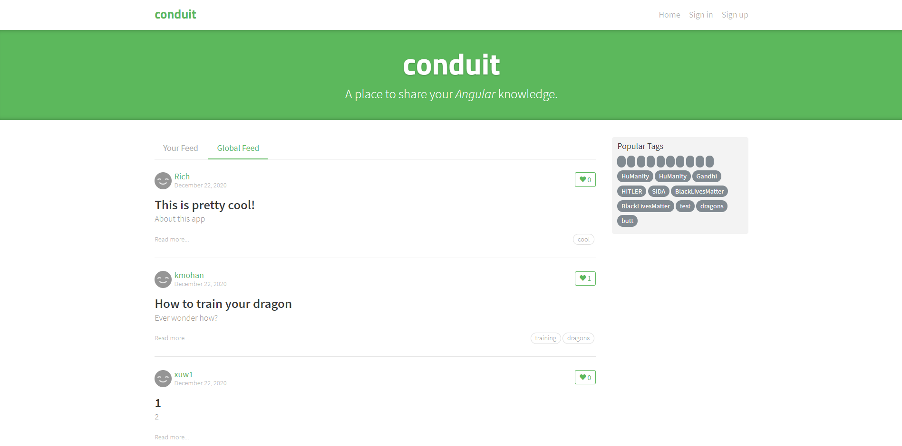

# 🖥🖱 Utilizando o Cypress E2E para testar um Blog em Angular

Testes End to End (E2E), para testar um Blog já pronto, feito em Angular.

## [Blog usado](https://github.com/gothinkster/angular-realworld-example-app)

  
 

 

  <a href="https://digitalinnovation.one/sign-up?ref=H395IYS4Z6">SE INSCREVER</a>
 

